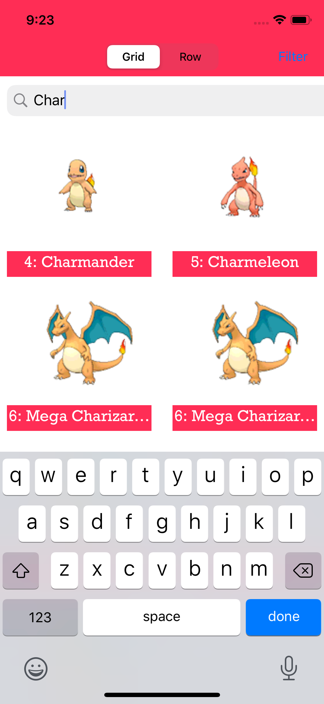
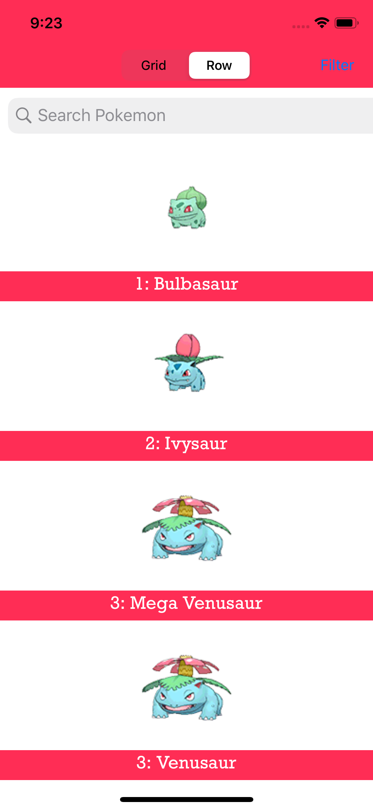

# Pokedex

Pokedex is a catalog of all Pokemon characters in the universe, helping millions of fans from all over quickly look up statistics and information for over 800 Pokemon. The app was made first by parsing a JSON file and then using UICollectionView to display the Pokemon in Grid or Row format. Users can further filter their search by selecting Pokemon by their statistics (attack, health, defense scores) as well as their types. The app is developed for iOS devices and is completed as part of my efforts at Mobile Developers of Berkeley -- (October 7, 2020)

<table>
  <tr>
    <td>First Screen Page</td>
     <td>Holiday Mention</td>
     <td>Present day in purple and selected day in pink</td>
  </tr>
  <tr>
    <td></td>
    <td></td>
    <td></td>
  </tr>
 </table>
